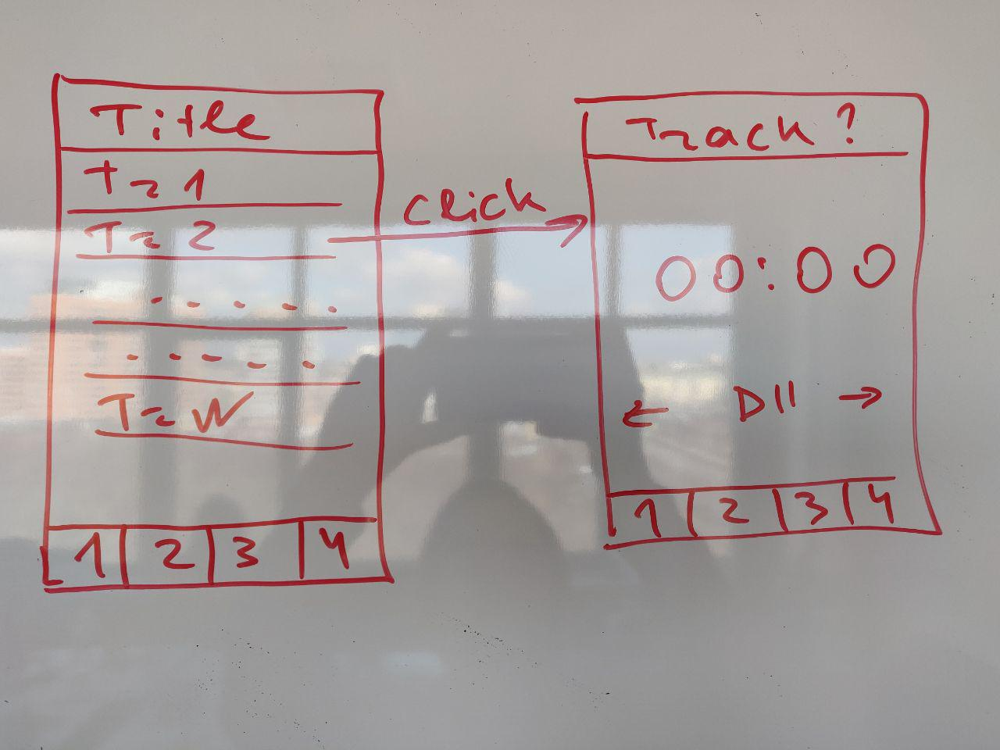

# Test Task App

Clone this branch and commit you work there

Create an app with 2 available screens.

Screen 1:

- nav bar at the bottom with 4 equal-sized rectangles (use this lib: https://github.com/aksonov/react-native-router-flux)
- title at the top of the screen
- list of tracks to choose from

Screen 2:

- title becomes the name of the track
- nav bar stays the same
- create audio player ui + functionality (play/pause, next/previous track, time indicator) (lib: https://github.com/GetStream/react-native-audio-player)

Clicking on any track should proceed to Screen 2. Make it possible to go to Screen 1 using an arrow.

Example of how should it approximately look like.

